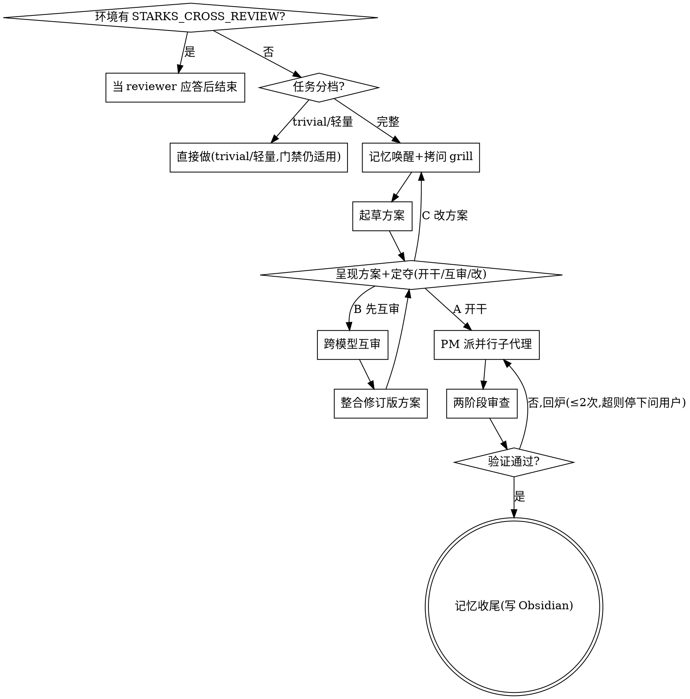

# starks — 任务启动器

## Overview

做真实任务的启动器。一句话：**先按任务分档决定走多重——简单的直接做，复杂的才走全流程：记忆唤醒 → 拷问需求 → 起草方案 →（用户要才）跨模型互审 → 用户确认 → PM 派并行子代理 → 两阶段审查 → 完成门禁 → 记忆收尾。** 完整档的派子代理 / 互审 / 记忆收尾用 `$STARKS_AGENT_MODEL`（你最强的模型，如 Claude opus / Codex gpt-5 系）、不计 token、质量优先；trivial / 轻量保持低开销，别动辄上子代理。

## Configuration

starks 从环境变量读几个设置（都可选，有默认 / 优雅跳过）：

| 环境变量 | 作用 | 默认 |
|---|---|---|
| `STARKS_AGENT_MODEL` | 并行子代理用的最强模型 | 你平台最强（如 Claude `opus`、Codex `gpt-5` 系）|
| `STARKS_REVIEW_MODEL` | 跨模型互审在**另一端**用的模型 | 同上 |
| `STARKS_MEMORY_DIR` | 项目记忆目录（如某 Obsidian vault 子目录）。**未设则跳过记忆收尾。** | 未设 |
| `STARKS_STYLE_NOTE` | 可选：记忆写手先读的文风笔记路径 | 未设 |

拷贝 `.env.example` 改成你的值。

## 环境守卫（防递归，最先检查）

若环境变量 `STARKS_CROSS_REVIEW` 已设置，说明你是被另一个模型调起来做**一次性方案审查**的。此时：
- 不要进入下面的 starks 流程，不要调用任何 skill，不要派子代理，不要反向调用模型。
- 直接对收到的方案做"补充 + 纠错"，输出批判性意见后结束。

## 任务分档（先判断，再决定走多重）

| 档位 | 什么任务 | 怎么做 |
|---|---|---|
| **trivial** | 一行小改、纯查询 / 概念解释、显然 typo、读已知文件、跑已知诊断命令 | 直接做。不拷问、不互审、不写记忆。 |
| **轻量** | 单一关注点、需求清晰、少数文件、低不确定性 | 直接做或一句话确认即可。**可跳过跨模型互审与并行子代理**；完成门禁仍适用；有实质进展才更新项目记忆。 |
| **完整** | 跨多文件 / 架构级 / 行为大改 / 明显不确定性 | 走下面的完整 Checklist（拷问 → 起草 → 呈现+定夺〔可选互审〕→ 并行子代理 → 两阶段审查 → 门禁 → 记忆）。 |

拿不准就往上靠一档。

- **全局适用（任何档位）**：① 完成门禁——声称"完成 / 通过 / 修好"前必须有当场跑出的验证证据；② 反模式表里关于"怎么分档"的条目；③ 记忆唤醒——设了 `STARKS_MEMORY_DIR` 且存在 `<项目>/`（项目名 = repo 根目录 basename，没有就查 `_index.md` 找相近条目）时，动手 / 拷问前先读其 `summary.md` + `memory.md`，已有答案的问题别再问用户；记忆是旧快照，引用文件 / 路径 / 约定前验证仍成立（trivial 档跳过）。
- **仅完整档适用**：HARD-GATE、状态机、完整档 Checklist（拷问 / 互审 / 并行子代理 / 两阶段审查 / 记忆收尾这套重流程）。

## 何时转交专用 skill（starks 是中枢，不重造）

- 遇到 bug / 测试失败 / 非预期行为 → 转 `systematic-debugging`（先找根因再修）
- 要写 / 改一个 skill → 转 `writing-skills`
- 超大 / 高不确定性的设计 → 先 `brainstorming` 做完设计再回 starks 编排

其余日常"起新活 / 编排 / 修小功能"留在 starks。

> 转交 = 调那个 skill 并照它走。Claude 用 `Skill` 工具；Codex 原生加载 skill，直接按其内容执行即可（两端这几个 skill 都已装）。

## <HARD-GATE>（针对完整档）

完整档任务：需求没敲定、用户没明确确认方案之前，**禁止**派子代理写代码、禁止落地任何实现。别拿"看起来简单"当借口把完整档降级——拿不准就按上面的分档往上靠。（trivial / 轻量档不受此 gate 约束。）

> 互审是可选增强、非 gate 硬前提；由 Checklist 第 3 步的三选定夺，不自动触发。

## 反模式（这些念头 = 停下）

| 念头 | 现实 |
|---|---|
| "这任务太简单，不用问" | 先按任务分档判断：trivial / 轻量可省拷问；判成**完整档**就别拿"简单"当借口，至少问一轮。 |
| "把完整档当轻量档蒙混" | 跨多文件 / 行为大改 / 高不确定 = 完整档，该提议的互审、该派的并行别省。拿不准往上靠一档。 |
| 自动跑互审 / 或闷头不提 | 互审由用户在第 3 步定夺：作为选项问，既不自动也不闷跳。 |
| "我自己审就行" | 单模型有系统性盲区——所以要把"让另一个模型过一遍"作为选项给用户，由用户拍板要不要。 |
| "末尾记忆可有可无" | 有实质、可复用的进展就更新项目总结；纯琐碎改动可不写，别给 vault 添维护负担。 |

## 流程（状态机）

## 完整档 Checklist（有 TodoWrite / update_plan 就用来跟踪，没有则跳过）

1. **拷问 grill** — 先记忆唤醒（见"全局适用"③）+ 探上下文（读相关文件 / 近期 commit）→ 提问多选优先：互不依赖的小问题合并一次问（如 AskUserQuestion 一次最多 4 问），答案影响后续走向的才逐个问；终端为主，需看图（mockup/架构/对比）才开 Visual Companion。挖隐藏假设、边界、成功标准。
2. **起草方案** — 收口需求 + 任务拆解（轻量，不单独产出 plan 文件）。
3. **呈现方案 + 一次定夺** ← HARD-GATE — 把方案给用户，三选：**A 直接开干 / B 先让另一个模型（Claude↔Codex）互审再定 / C 改方案**。选 B 才跑互审，整合修订版后回到本步再定夺；选 A 即放行。互审不自动触发、也不闷头跳过不提。
4. **PM 编排** — 拆得开就把互不依赖的部分并行派子代理（2-10 个）；串行依赖强、拆不开就主代理顺序做并记原因，别为并行而硬拆。关键决策把关。
5. **两阶段审查** — 派 reviewer 按 `prompts/spec-review.md` 查 spec 合规 → 按 `prompts/code-review.md` 查代码质量，输出结构化清单（文件:行号 / 阻塞或建议）；不过回炉，**最多回炉 2 次**，仍不过就停下，把卡点与选项如实呈给用户定夺。
6. **完成门禁** — 当场跑出验证证据才宣称"完成 / 通过"。
7. **记忆收尾** — 有实质进展就派子代理更新 Obsidian 项目总结（纯琐碎改动跳过）；本次挖出的稳定偏好 / 纠错反馈由主代理写进平台原生记忆（Claude / Codex 各自的 memory 目录），Obsidian 只放叙事总结、指回不复制。

## 跨模型互审怎么做

**前提：用户在第 3 步选了 B（要互审）**。审查提示（`prompts/cross-review.md`）当命令行参数，**方案全文走 stdin**（here-doc `<<'EOF' … EOF` 或 `cat 临时方案文件 |` 管道喂入）——**别把方案拼进命令行参数**：长方案当参数会撞系统 `ARG_MAX` 上限，轻则报 `argument list too long`、重则被静默截断让 reviewer 只看到半截方案。务必带 `STARKS_CROSS_REVIEW=1` 防递归：
- Claude → Codex：`STARKS_CROSS_REVIEW=1 codex exec -c 'skills.config=[{name="starks",enabled=false}]' -m "$STARKS_REVIEW_MODEL" "<cross-review.md 审查提示>" <<'EOF'` … 方案全文 … `EOF`（`-c` 这段结构性禁掉被审端的 starks——reviewer 根本看不见它，防递归不再只靠自觉；Codex 无全局禁 skill 开关，其余 skill 由审查提示里"禁止调用任何 skill"约束；codex 把 stdin 作为 `<stdin>` 块附加。注意：codex 要求在受信任目录跑，非 git 仓需加 `--skip-git-repo-check`）
- Codex → Claude：`STARKS_CROSS_REVIEW=1 claude -p --model "$STARKS_REVIEW_MODEL" "<cross-review.md 审查提示>" <<'EOF'` … 方案全文 … `EOF`

单轮、同步等结果；超时设 10 分钟左右防 hang（不计 token，但不可卡死）。拿回意见后由你整合成修订版方案，再给用户确认。

**互审失败兜底**：若被调 CLI 报错、模型不可用（如你的 provider 凭证 / 网络问题）、或超时——**不要静默跳过假装互审通过**。如实告诉用户"互审未完成（原因 X）"，并给选项：A 手动重试 / B 换可用模型 / C 用户授权本次跳过互审直接进确认。由用户拍板，不擅自略过。

## PM 编排

把复杂任务里**互不依赖**的部分拆成并行子代理（2-10 个）同时启动以求最快；**拆不开 / 串行依赖强的就主代理顺序做、别硬拆**（硬拆只增协调成本）。你当 PM，关键决策你把关。子代理默认模型：`$STARKS_AGENT_MODEL`（你最强的模型，如 Claude opus / Codex gpt-5 系）。子代理 prompt 要 focused / self-contained / 写清输出与验收标准，并显式列出该子代理**拥有写权的文件**——并行子代理的写集合必须互斥；拆不出互斥写集就改顺序做，或用隔离 worktree（Claude：Agent `isolation: "worktree"`；Codex：手动 `git worktree`）。各切片完成即各自进入两阶段审查（流水线，不等全员到齐），整体验证门禁才是唯一汇合点。

## 记忆收尾

验证通过后，**若 `$STARKS_MEMORY_DIR` 未设置则跳过记忆收尾**（Obsidian 记忆层是可选的）。否则，**若本次有实质、可复用的进展**（琐碎改动跳过，见 Checklist 第 7 步），派一个子代理（`$STARKS_AGENT_MODEL`）按 `prompts/memory-writer.md` 更新项目记忆（`$STARKS_MEMORY_DIR/<project>/`）。

本节只管**触发与边界**：① 何时写（有实质进展才写）② **绝不碰 `private/`** ③ 失败就如实报告、不假装写了。具体写法 / 风格 / 路径 / vault 约定 / shell 写入（绕开拦 Write 的 hook）都在 `prompts/memory-writer.md`，子代理照它走。

## 跨平台工具对照

| 动作 | Claude | Codex |
|---|---|---|
| 派并行子代理 | `Task`/`Agent` 工具 | `spawn_agent` |
| 并行写隔离（写集合冲突时） | Agent `isolation: "worktree"` | `git worktree` 手动 |
| 等结果 / 释放 | 自动返回 | `wait_agent` / `close_agent` |
| 交互式提问 | `AskUserQuestion` | 终端追问 |
| 进度跟踪 | `TodoWrite` | `update_plan` |
| 浏览器可视化 | 复用 superpowers Visual Companion 脚本 | 同脚本（`CODEX_CI` 自动前台） |
| 跨模型互审 | `codex exec …`（完整命令见"跨模型互审怎么做"） | `claude -p --model "$STARKS_REVIEW_MODEL" "…"` |
| 子代理默认模型 | `$STARKS_AGENT_MODEL` | `$STARKS_AGENT_MODEL` |

## 红旗清单（宣称完成前自检）

| 红旗 | 处置 |
|---|---|
| "应该没问题" / 没跑验证就说完成 | 回到完成门禁，跑出证据。 |
| 拷问时问了项目记忆里已有答案的问题 | 先记忆唤醒再拷问，别让用户重复自己。 |
| 没问用户就自动跑了互审 / 或闷头跳过没提互审 | 都不对：互审要作为选项问用户，由用户决定跑不跑。 |
| 子代理用了非 `$STARKS_AGENT_MODEL` | 改回最强模型。 |
| 记忆写进了 `private/` | 严重违规，立即撤回。 |
| 互审时被调模型又触发了 starks | 防递归守卫失效，检查 `STARKS_CROSS_REVIEW` 是否传入。 |
